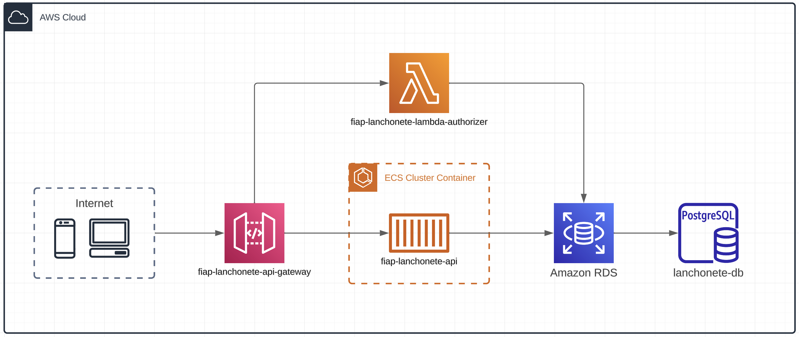

# fiap-lanchonete-api-gateway


[](https://docs.aws.amazon.com/pt_br/apigateway/latest/developerguide/welcome.html)

[](https://github.com/localstack)

## 📄 Descrição

Este projeto serve para gerenciar e versionar alterações no api gateway que serve como bff para o serviço da lanchonete.



Os seguintes repositórios também fazem parte desse projeto:

> [fiap-lanchonete-terraform](https://github.com/MarcosPrata/fiap-lanchonete-terraform) - Reponsável por provisionar a infra na AWS.

> [fiap-lanchonete-api](https://github.com/MarcosPrata/fiap-lanchonete-api) - API core responsável por registrar e acompanhar pedidos e usuários.

> [fiap-lanchonete-lambda-authorizer](https://github.com/MarcosPrata/fiap-lanchonete-lambda-authorizer) - Reponsável por autenticar e autorizar as chamadas requests dos usuários.

## 🚀 Quick Start

Para trabalhar em ambiente local é necessário:

- Instalar e configurar o [AWS CLI](https://docs.aws.amazon.com/cli/latest/userguide/getting-started-install.html) na sua máquina.

1. Preparando o [LocalStack](https://localstack.cloud/)
    - Caso não tenha uma instância do localstack rodando ainda, execute o seguinte comando na pasta raiz para subir o container do localstack

    ``` bash
    yarn localstack:run
    ```

    - Quando o ambiente do localstack estiver pronto. Execute este comando para criar o API Gateway. O link para o API Gateway será exibido ao fim desse script.

    ``` bash
    yarn localstack:apigateway:create
    ```

    - Caso tenha alterado o arquivo gateway.yml e queira atualizar o API Gateway, pode fazer isso através do script:

    ``` bash
    yarn localstack:apigateway:update
    ```

    - Para ver os recursos criados use:

    ``` bash
    yarn localstack:apigateway:resources
    ```

## 📤 Deploy

Temos o github actions configurado, de modo que qualquer push na main dentro da pasta api realizará o deploy do API Gateway na AWS para prod, equanto pushs na develop gerarão deploys em staging.

## 🎓 Integrantes / Devs

> Nome: Marcos Henrique Prata Junior
> 
> Matrícula: RM349949
> 
> [](https://www.linkedin.com/in/marcos-henrique-prata-junior/)
> [](https://github.com/MarcosPrata)

> Nome: Marcos Moreira
>
> Matrícula: RM349544
>
> [](https://www.linkedin.com/in/moreira-dev/)
> [](https://github.com/MarcosPotato)


> Nome: Marcelo Gonçalves de Barros
>
> Matrícula: RM349535
>
> []()
> []()


> Nome: Henrique de Paula Leite
>
> Matrícula: RM350046
>
> []()
> []()
